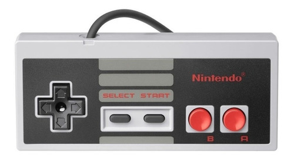

# Nintendo remote control
***

##### First project, in which all classmates have to make a video console or their remote control (as is my case).

***
 

***
## Installation:

Click on the following link

https://ibralzuru.github.io/ConsoleProjectIbra/

***

## Technologies:

* Html5
* CSS

***
## Collaboration:

The class, the teacher and me.
